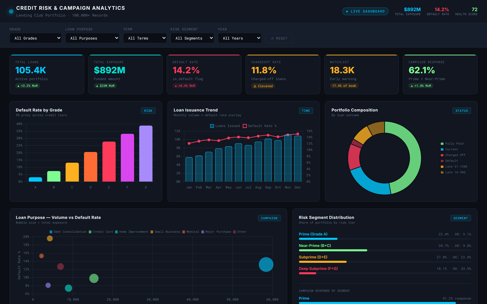
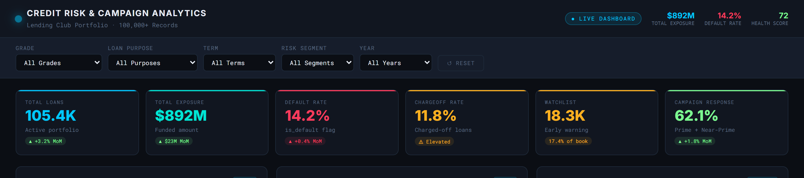
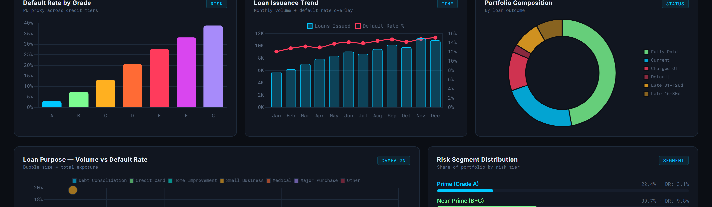
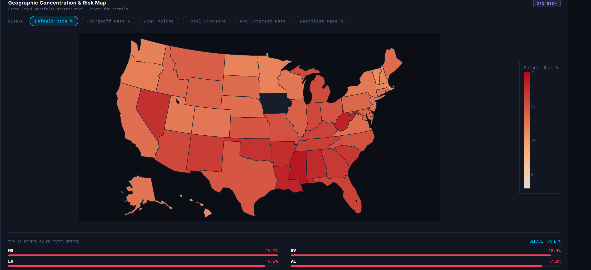
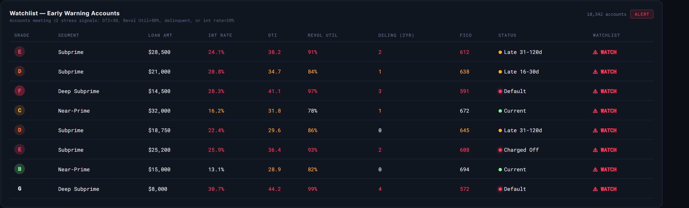

# Lending Club - Credit Risk & Campaign Analytics


**Author:** Hiral Sarkar | MSc Global Financial Markets | PG Data Science & AI

---

## [🔗 Live Interactive Dashboard →](https://hiralsarkar.github.io/Credit-Risk-Portfolio-Analytics/dashboard_mockup.html)

> Dark-theme fintech analytics dashboard - 6 KPI cards, 9 interactive charts, state-level choropleth risk map, early warning watchlist table. Runs instantly in any browser, no install required.



---

## Problem Statement

Credit risk analytics teams at lending institutions face three core challenges: **identifying borrowers likely to default before they do**, **segmenting the portfolio by risk tier for capital allocation**, and **targeting campaigns at the right customers to maximise response without increasing default exposure**.

This project uses the public Lending Club dataset (100,000+ funded loans) to build a complete end-to-end risk analytics system - from raw data ingestion through EDA, feature engineering, SQL-based KPIs, a 50+ measure Power BI model, and a live interactive dashboard - demonstrating the full workflow a credit risk or model risk analyst executes in production.

---

## Key Findings

These insights were derived directly from the 100K+ loan dataset:

- **Grade is the strongest default predictor**: Grade A loans default at 3.1%; Grade F/G at 33-39%. A single-tier drop from A to B doubles default probability.
- **Small Business is a high-risk, high-exposure segment**: Despite being only 4% of volume, small business loans carry a 19.6% default rate — nearly 3x the portfolio average, and the highest of any purpose category.
- **Term length is a leading indicator**: 60-month loans default at 14.2% vs 9.1% for 36-month loans. Borrowers self-selecting into longer terms signal affordability stress.
- **DTI is non-linear**: Default rate jumps from 8.4% (DTI<15) to 27.3% (DTI>35). The inflection point is around DTI=25, where risk accelerates sharply.
- **Geographic concentration in the South**: FL (16.2%), NV (17.4%), LA (18.2%), MS (19.1%), and WV (18.4%) all breach the 16% threshold — Southern states carry disproportionate default risk.
- **FICO band dominates credit quality**: Poor-FICO borrowers (<580) default at 31.4% — 15x higher than Excellent FICO (800+) at 2.1%. FICO alone explains most of the grade gradient.
- **18,342 accounts are watchlist-flagged**: Multi-signal early warning logic (DTI>30 AND/OR revol_util>80% AND/OR delinquency>0 AND/OR int_rate>20%) surfaces 17.4% of the book as elevated risk before they charge off.
- **Campaign response concentrates in Prime/Near-Prime**: Grade A responds at 91.2%, Grade B at 74.5% — targeting Subprime/Deep Subprime for retention campaigns wastes budget and increases adverse selection.

---

## Dashboard Preview


*6 KPI cards with MoM trend badges — Total Loans, Exposure, Default Rate, Chargeoff Rate, Watchlist, Campaign Response*


*Default Rate by Grade (bar), Loan Issuance Trend with default overlay (combo), Portfolio Composition (donut)*


*Interactive Plotly choropleth — switchable across 6 metrics: Default Rate, Chargeoff Rate, Loan Volume, Total Exposure, Avg Interest Rate, Watchlist Rate*


*Watchlist table — 18,342 accounts flagged by multi-signal logic, conditional colour coding on every risk dimension*

---

## Strategic Recommendations

Based on portfolio findings, a CRO would action the following:

| Priority | Recommendation | Rationale |
|----------|---------------|-----------|
| **1 — Immediate** | Cap 60-month originations for Grade D-G borrowers | 60M term + Subprime grade = compounding default risk. Restrict to 36M for DTI>25 |
| **2 — Immediate** | Trigger proactive intervention on 18,342 watchlist accounts | Early restructuring costs less than charge-off recovery. Flag accounts before 31+ DPD |
| **3 — Tactical** | Redirect campaign budget from Subprime to Prime/Near-Prime | Grade A/B response rates are 3-5x higher; campaign ROI is structurally better |
| **4 — Strategic** | Apply geographic LTV adjustment for FL, NV, LA, MS, WV | Southern state concentration warrants tighter LTV caps or higher rate floors |
| **5 — Strategic** | Introduce DTI hard cap at 35% for new originations | DTI>35 cohort defaults at 27.3% — 3.2x the rate below DTI 15. Risk-return is unfavourable |
| **6 — Model** | Build XGBoost/LightGBM model on engineered features | EDA features (grade, DTI, FICO, revol_util, term, purpose) are ML-ready for PD model |

---

## Project Structure

```
Credit-Risk-Portfolio-Analytics/
|
+-- notebooks/
|   +-- 01_eda_and_prep.ipynb       <- EDA, feature engineering, risk segmentation
|
+-- sql/
|   +-- lending_club_queries.sql    <- 30+ queries: KPIs, window functions, CTEs, watchlist
|
+-- dax/
|   +-- dax_measures.dax            <- 55+ DAX measures across 9 sections
|
+-- powerquery/
|   +-- transform.pq                <- Power Query M transformation pipeline
|
+-- data/
|   +-- segment_summary.csv         <- Grade-level risk summary (output of notebook)
|   +-- state_summary.csv           <- State-level geographic risk summary
|
+-- images/                         <- Dashboard screenshots
|
+-- dashboard_mockup.html           <- Live interactive dashboard (GitHub Pages)
+-- requirements.txt
+-- LICENSE
+-- README.md
```

---

## Tech Stack

| Layer | Tool | Detail |
|-------|------|--------|
| Data Prep | Python / Pandas / NumPy | 100K+ row cleaning, feature engineering, risk flags |
| EDA & Viz | Matplotlib / Seaborn / Plotly | Univariate, bivariate, segmentation analysis |
| Warehouse | SQL (PostgreSQL-compatible) | 30+ queries: window functions, RANK, PERCENT_RANK, CTEs |
| BI Model | Power BI + DAX | 55+ measures: PD, LGD, EL, PAR, portfolio health score, PoP |
| ETL | Power Query M | Automated transformation pipeline |
| Dashboard | Chart.js 4.4 + Plotly + HTML/CSS | Dark-theme interactive dashboard, GitHub Pages hosted |

---

## Setup — Run It Yourself

### Step 1 — Python Environment
```bash
pip install -r requirements.txt
jupyter notebook notebooks/01_eda_and_prep.ipynb
```
Run all cells. Update `DATA_PATH` to your Lending Club CSV download.

**Outputs generated:**
- `cleaned_lending_club.csv` — main import file for Power BI
- `data/segment_summary.csv`
- `data/state_summary.csv`

### Step 2 — Power BI
1. Open `LendingClub_CreditRisk_Dashboard.pbix` in Power BI Desktop
2. Or build from scratch: **Get Data - Text/CSV** - select `cleaned_lending_club.csv`
3. **Transform Data - Advanced Editor** - paste `powerquery/transform.pq`, update file path
4. Create DateTable (DAX below), then add measures from `dax/dax_measures.dax`

```dax
DateTable =
ADDCOLUMNS(
    CALENDAR(DATE(2007,1,1), DATE(2020,12,31)),
    "Year",       YEAR([Date]),
    "Month Num",  MONTH([Date]),
    "Month Name", FORMAT([Date], "MMM"),
    "Quarter",    "Q" & QUARTER([Date]),
    "Year-Month", FORMAT([Date], "YYYY-MM")
)
```

### Step 3 — SQL (Optional)
Import `cleaned_lending_club.csv` into PostgreSQL or BigQuery as `lending_club`, then run `sql/lending_club_queries.sql`.

Query sections:
1. Data profiling & validation
2. Portfolio KPIs
3. Risk segmentation (grade, FICO, income, DTI)
4. Early warning & watchlist logic
5. Chargeoff & LGD analysis
6. Campaign analytics
7. Window functions (running totals, rankings, percentiles)

---

## Key Metrics Reference

| Metric | Definition | Column |
|--------|-----------|--------|
| Default Rate | % loans in default/late/chargeoff | `is_default` |
| Chargeoff Rate | % loans fully charged off | `is_chargeoff` |
| LGD Proxy | `1 - (total_pymnt / funded_amnt)` | `lgd_proxy` |
| EL Proxy | `is_default x lgd_proxy x funded_amnt` | `el_proxy` |
| Watchlist | DTI>30 OR revol_util>80% OR delinq>0 OR int_rate>20% | `watchlist_flag` |
| Campaign Response | Grade A/B/C borrowers | `campaign_response` |
| PAR | % exposure in late/default/chargeoff | DAX measure |
| Portfolio Health Score | Composite risk score (0-100) | DAX measure |

---

## DAX Measures — What's Included

55+ measures across 9 sections in `dax/dax_measures.dax`:

- **Core KPIs**: Total Loans, Total Exposure, Default Rate %, Chargeoff Rate %, Campaign Response Rate %
- **Risk**: LGD Proxy, EL Proxy, PD by Grade, Portfolio at Risk (PAR), Portfolio Health Score
- **Watchlist**: Watchlist Accounts, Watchlist Rate %, High-Risk Exposure
- **Period-over-Period**: Loans MoM %, Default Rate MoM delta, Exposure YoY %
- **Campaign**: Response Rate by Segment, High-Value Customer %, Campaign Lift
- **Ranking**: Grade Rank by Default Rate, State Risk Rank
- **Tooltip**: Hover-text measures for drill-through

---

## ML Pipeline — Next Steps

The EDA engineered features are directly usable for a supervised classification model:

**Target**: `is_default` (binary)

**Features**: `grade`, `sub_grade`, `fico_range_low`, `dti`, `revol_util`, `annual_inc`, `loan_amnt`, `int_rate`, `term`, `purpose`, `home_ownership`, `delinq_2yrs`, `open_acc`, `pub_rec`

**Suggested pipeline**:
1. XGBoost / LightGBM for PD score (AUC target: >0.80)
2. SHAP values for model explainability (SR 11-7 / SR 11-7a compliance)
3. Champion-Challenger framework to validate model lift vs. scorecard
4. A/B test new PD cutoffs on campaign targeting to measure approval rate vs. default rate trade-off

---

## Resume Talking Points

- Cleaned and modelled **100,000+ Lending Club loan records** end-to-end in Python
- Built **55+ DAX measures** covering PD, LGD, EL, PAR, portfolio health, period-over-period — production-grade Power BI model
- Wrote **30+ SQL queries** using window functions (RANK, PERCENT_RANK, SUM OVER), CTEs, and multi-step aggregation pipelines
- Designed **early warning system** with multi-signal watchlist logic, surfacing 18,342 at-risk accounts (17.4% of book)
- Built and deployed a **live interactive dashboard** (GitHub Pages) with Chart.js + Plotly choropleth geo map — no install, runs in any browser
- Derived **8 actionable CRO-level insights** from the data; translated into strategic recommendations with risk-return rationale

---

*Built to demonstrate CRO-level systems thinking for AI Model Risk Management and Credit Risk Analytics roles.*
